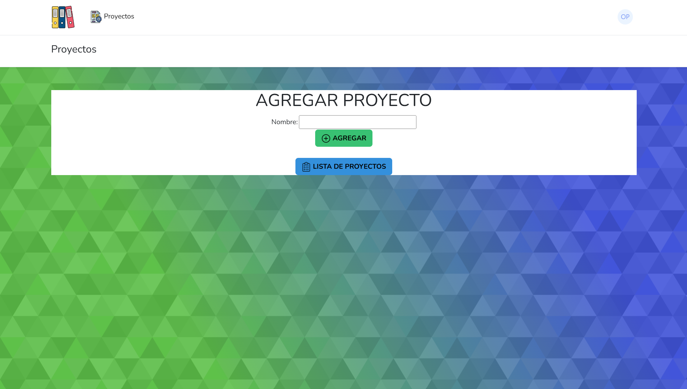

<h1 align="center"> 📚 Gestor de proyectos</h1>


**Gestor de proyectos**, es una aplicación web desarrollado con **Laravel 9.19** y **JetStream**, diseñada para la gestión de proyectos de software. Permite crear proyectos, listar artefactos, definir actores, y más.

Este proyecto fue creado por estudiantes para la materia de *Desarrollo WEB*, por lo que pude tener limitaciones en su estructura o robustez.

## 📍 Características

- Creación y gestión de proyectos.

- Listado de proyectos con filtros básicos.

- Gestión de artefactos y actores asociados a cada proyecto.

- Autentificación de usuario con JetStream.

- Interfaz responsiva con Bootstrap.

## 🛠️ Tecnologías

- **Laravel 9.19**

- **PHP 8.2**

- **MySQL**

- **JetStream**

- **Bootstrap**

## 📁Estructura del proyecto

Laravel ofrece una estructura definida cuando se crea el proyecto, pero el proyecto tiene modificaciones notables en las siguientes secciones:

- **`/app/Http/Controllers`:** Controladores personalizados para gestionar proyectos, artefactos y actores.

- **`/app/Models`:** Modelos para la lógica de datos.

- **`/database/migrations`:** Migraciones para las tablas de proyectos, actores, artefactos, etc.

- **`/resources/views`:** Vistas Blade para la interfaz de usuario.

- **`/routes/web.php`:** Definición de rutas para las funcionalidades principales del proyecto.

## 🚀 Instalación:

Sigue los siguientes pasos para ejecutar el proyecto localmente.

### ✅Requisitos

- PHP >= 8.0

- Composer 2.x

- Node.js >= 16.x

- MySQL o cualquier base de datos compatibles con Laravel

- Git

### 💡 Pasos

1. **Clona el repositorio:** Usa el comando:  
	```bash
	git clone https://github.com/OscarPachecoH/proyectoGP
	```
2. **Instalas las dependencias:** Entra al proyecto en tu maquina e instala las dependencias: 
	```bash
	cd proyectoGP
	composer install
	npm install
	```

3. **Verifica archivo .env.example:** En este archivo esta la estructura de las variables de entorno del proyecto, crea un archivo y llámalo .env, después copia todo el contenido del archivo .env.example en .env.

4. **Crear key app:** Usa el comando 
	```bash
	php artisan key:generate
	 ```
y verifica que esta en tu archivo .env

5. **Crear base de datos:** Crea la base de datos en tu gestor y llamala proyectogp.

6. **Ejecuta migraciones:** Usa el comando 
	```bash 
	php artisan migrate
	```

7. **Inicia el servidor:** Inicia el proyecto con 
	```bash 
	php artisan serve
	```
	 y abre [http://localhost:8000](http://localhost:8000) en el navegador.


## 🔒Licencia

Este proyecto está bajo la Licencia MIT (LICENSE). Siéntete libre de usarlo como inspiración o modificarlo. Para colaboraciones, contáctame en josuehernaa@gmail.com (mailto:josuehernaa@gmail.com).

## 🙌 Agradecimientos

A mis compañeros de equipo y profesores por su apoyo durante el desarrollo de este proyecto para la materia de Desarrollo Web.